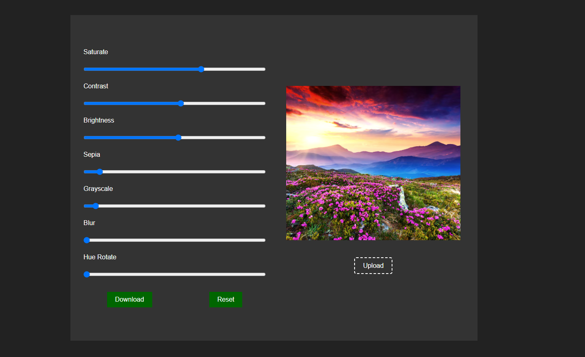

# 🖼️ JavaScript Image Filters App

A simple and responsive web app that allows users to **upload an image**, **apply real-time filters**, and **download the edited version** — all done using **HTML**, **CSS**, and **JavaScript**.

## 🛠️ Tech Stack

- **HTML5** – Layout and structure  
- **CSS3** – Responsive styling and layout  
- **JavaScript (ES6)** – Image handling, filters, and download functionality

## ✨ Features

✅ **Upload Your Own Image** from your device  
✅ **Apply CSS-Based Filters** like:  
  - Brightness  
  - Contrast  
  - Saturation  
  - Blur  
  - Grayscale  
  - Sepia  
✅ **Live Preview** of filter effects in real-time  
✅ **Download Final Image** with applied filters  
✅ **Reset Filters** to original image  
✅ **Responsive Design** for mobile and desktop

## 📸 Preview

## 🚀 Live Demo

[🔗 View Live](https://ahmedragab15.github.io/JavaScript-Image-Filters-App)